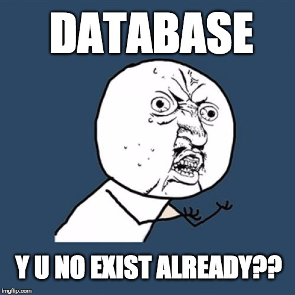

## yunoDB

A portable, persistent, electron compatible fulltext search database. LevelDB underneath.

[](https://github.com/feross/standard)

## How it works

yuno is a JSON document store with fulltext search. It's meant for in in electron apps, focuses solely on text search, and in most cases should handle millions of documents easily.

yuno is pretty basic - it has two main components:
- the document store, which is just the raw JSON objects stored in [leveldb](https://github.com/Level/levelup)
- the inverted search index, powered by [search-index](https://github.com/fergiemcdowall/search-index). Importantly, fields that will be searchable are passed through a customisable [natural](https://github.com/NaturalNode/natural) language processing pipeline prior to being added to the index, greatly improving speed and memory usage compared to the vanilla search-index

**None of this is revolutionary** - actually it's standard in the major search contenders like `elasticsearch` and `solr`. And all the pieces exist already in the node ecosystem. But I couldn't find a node fulltext search and document store that could handle millions of documents, persisted on disk, didn't have crazy memory requirements and could be easily bundled into an electron app.

Like, db, **y** **u** **no** exist already??



## install

```
npm install --save yunodb
```

## use

1. create / load a database
2. add documents
3. search

### create / load a database

calling `yuno`

**`yuno(options, callback)`**

e.g.

```
var yuno = require('yuno')

var dbopts = {
  location: './.yuno',
  keyField: 'id',
  indexMap: ['text']
}
var db = yuno(opts, (err, dbhandle) => {
  if (err) throw err

  // do stuff with the db
  db = dbhandle
})
```

`opts` configures the two persistent datastores. Possible key-value pairs are:

- **location** (String, required) - Base directory in which both datastores will be kept.
- **keyField** (String, required) - Field in each document to be used as a key in the document store.
- **indexMap** (Array | Object, required) - Fields to index for fulltext searching. See [index mapping](#index_mapping) below for details.

#### index mapping

It is quite rare that all fields in a database should be exposed to the user search. More often, we want to allow the user to search certain fields, but retrieve the full document for each result. The `indexMap` option allows you to specify how to index documents.

There are two ways to tell `yuno` how to index:

##### 1. Pass an Array of fields

The simple option - an array of fields to index. The contents of each field will be passed through the default Natural Language Processing pipeline before being added to the search index.

##### 2. Pass an Object mapping fields to processors

To fine-tune the processing on a per-field basis, pass an Object where each key is a field to index. Values can be one of:

- `true`/`false` whether to apply the default NLP pipeline
- `function` a custom processing function.

Custom processing take the field value as a single argument, and their return value (either a string or an array) will be tokenised and added to the index.

### add documents

**`db.add(documents, options, callback)`**

- `documents`, array of JSON-able objects to store
- `indexMap` optional, overrides the database-wide `indexMap` option
- `callback`, function to call on completion, with a single argument to be passed an error if there was one

e.g.

```js
var docs = [
  { id: 1, text: 'hello '},
  { id: 2, text: 'goodbye '},
  { id: 3, text: 'tortoise '}
]

function done (err) {
  if (err) throw err
  console.log('successfully added', docs.length, 'documents')
}

db.add(docs, done)
```

or using a custom `indexMap`:

```js
// trim whitespace
function trim (str) { return str.trim() }

db.add(docs, { text: trim }, doneAdding)
```

### search

**`db.search(query, opts, callback)`**

Returns a cursor that can be used to page through the results. By default the `pageSize` is 50.

- `query`, string search query
- `opts`, (optional) options object
- `callback`, function to call on completion. Takes two arguments:
  - `err` error or `null`
  - `results` object containing the result metadata and hits

e.g.

```js
var cursor = db.search('tortoise', function(err, results) {
  if (err) throw err

  // first 50 results
  console.log(results)

  cursor.next(function(err, results) {
    // next page in here
  })
})
```

## contributing

Contributions are very welcome. **Please** open an issue to discuss any changes you would like to PR, or mention in an existing issue that you plan to work on it.
